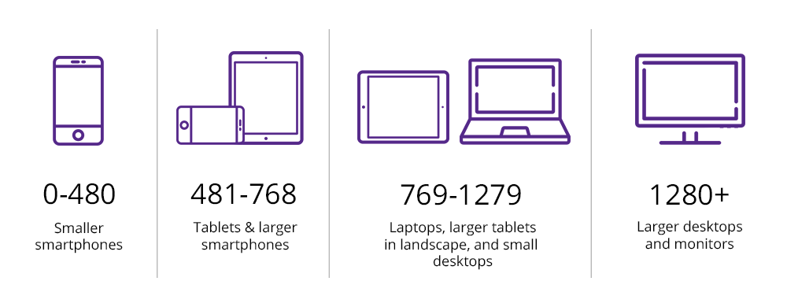

# Media Queries

## min-width
Es como un **if** en css , como decir → *“Desde este ancho, hacia arriba”*

```css
@media (min-width: 460px){
    body {
        background: red;
    }
}
```

## max-width
Es como un **if** en css , como decir → *“Desde este ancho, hacia abajo”*

```css
@media (max-width: 768px){
    body {
        background: ryellow;
    }
}
```

## Mobile-first

```css
body {
    background: red;
}
@media (min-width: 460px){
    /* Tablets */
}
@media (min-width: 768px){
    /* Laptop */
}
```

## Mobile-last
```css
body {
    background: red;
}
@media (max-width: 768px){
    /* Tablets */
}
@media (max-width: 460px){
    /* Smartphones */
}

```

## Los breakpoints

Llamamos breakpoints o puntos de quiebre a cada salto de tamaño sobre el cual aplicamos una media query. 

No hay una regla fija sobre cuáles usar, pero acá dejamos los más utilizados.

 

